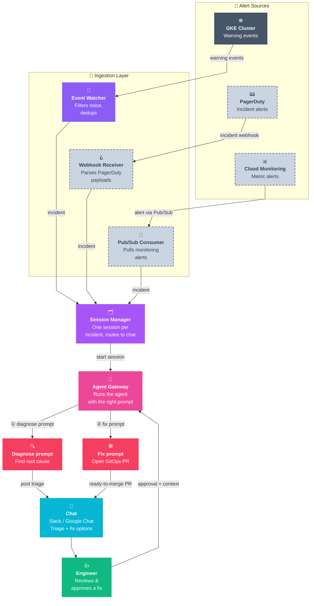

# Troubleshooting Pipeline — Architecture

> **Legend:** solid boxes = live today · dashed grey boxes = planned extension.

## The moving parts

| Layer | Component | Role |
|-------|-----------|------|
| **Sources** | GKE / PagerDuty / Cloud Monitoring | Three independent alert feeds — cluster events, on-call incidents, and metric-based alerts. |
| **Ingestion** | Event Watcher · Webhook Receiver · Pub/Sub Consumer | One adapter per source; each filters/parses its feed and hands off a clean incident. |
| **Session Manager** | | Mints one session per incident, posts the initial alert to chat, maps chat thread ↔ session, stores the triage report, and kicks off the agent. (Dedup happens upstream in the Event Watcher.) |
| **Agent Gateway** | | Runs the Platform Agent with the right prompt for the current step. |
| **Platform Agent** | Diagnose prompt · Fix prompt | One LLM, driven by two prompts: first diagnoses root cause and posts a plain-language triage; after approval, opens a ready-to-merge GitOps PR. |
| **Chat (human-in-the-loop)** | | Where the team sees the diagnosis, weighs fix options, and approves. |

> **Key design principle:** every source posts through one shared inject envelope carrying a `kind` tag (today only `k8s-event` is implemented), so a new feed plugs into the same session → diagnose → chat → approve → fix pipeline. The goal is that adding a source is just adding one more adapter; the agent branches on `kind` rather than each source needing its own downstream path.

## What's working today

The GKE-events path is live end to end:

- **Detection** — `k8s-event-watcher` streams warning events in real time (`OOMKilled`, `CrashLoopBackOff`, `FailedScheduling`, `Evicted`, and ~12 reasons total), with namespace deny/allow rules and a flapping guard to cut noise.
- **Dedup** — a 24h rolling window collapses repeats and related reasons into one incident, so a flapping pod doesn't spam the team.
- **Session + routing** — the Session Manager mints one session per incident (SQLite-backed), posts the alert to the right chat thread, and stores the triage report for follow-up replies.
- **Triage** — the Platform Agent diagnoses root cause and posts a plain-language summary with fix options to Slack / Google Chat.
- **Human-in-the-loop** — an engineer approves a fix in-thread; nothing touches production without that approval.
- **Remediation** — the approved fix ships as a GitOps PR (reviewable, revertible — no direct cluster mutation).

## Extending the pipeline

Because sources are decoupled by the adapter + normalization boundary, growth is additive and low-risk.

**New sources** — each is just one more adapter that emits the normalized incident schema; the agent, chat, approval, and fix stages need no changes:

- **PagerDuty → Webhook Receiver** — parse incident webhooks into the normalized incident schema.
- **Cloud Monitoring → Pub/Sub Consumer** — pull metric-based alerts off a subscription.
- Others: Prometheus Alertmanager, Grafana alerts, Argo CD / Flux events, security scanners, cloud audit logs.

**Beyond sources** — the same decoupling lets other stages grow independently:

- **Swap or drop a source** — e.g. *"PagerDuty is being sunset, let's move off it"*: replace that single adapter (say, with Opsgenie or Alertmanager) or remove it entirely. Nothing else in the pipeline is touched.
- **Add a remediation target** — today it's GitOps PRs; the same approval loop could drive Terraform PRs, runbook execution, or guarded direct API calls.
- **Add a response surface** — Microsoft Teams, ServiceNow, or a PagerDuty responder alongside chat.
- **Grow the agent's reach** — the agent can only correlate across domains its tools can read. Today that's `kubectl` / `gcloud` context (logs, k8s events, RBAC, networking, storage) through the two MCP servers wired in `agents/platform/config.yaml`. New tools are additive — no pipeline changes:
  - **Prometheus MCP server** *(high-value next step)* — the agent has **no metric-value query capability today**; it can only link out to dashboards. Wiring a Prometheus/PromQL MCP under `mcp_servers:` (same pattern as the existing hosted GKE MCP) lets it read actual metrics in-session — unlocking the **metric-driven cross-domain CUJs** (scale-up pressure, saturation → capacity/quota) that are currently out of reach.
  - **Quota-inspection tool** — no quota tool exists today; a small `gcloud`-backed tool closes the other cross-domain gap.
  - Others: runbook retrieval, log-search skills, cost/BigQuery lookups.

## The CUJs that make this worth building

Single-domain failures (an OOMKill, a bad image tag) are easy — one engineer, one dashboard, done. The journeys that hurt are **cross-domain**: the symptom surfaces in one domain but the root cause lives in another, so the human looking at it can't fix it and a multi-team hand-off begins. That hand-off is where incident time goes — and it's exactly what one agent, able to pull whatever context its tools expose in a single session, can collapse.

| Symptom (where the human looks) | Root cause (where the fix is) | Real example |
|---|---|---|
| Pods stuck **Pending** — *Workload* | **Scheduling** / **capacity / quota** | Insufficient GPU · untolerated taint · `SSD_TOTAL_GB` quota exceeded on PVC provision |
| **Scale-up failing** — *Scalability* | **Quota** exhausted in Compute / networking | `scale.up.error.quota.exceeded` · `IP_SPACE_EXHAUSTED` |
| **App not starting** — *Workload* | **Networking** path broken | ImagePullBackOff · webhook i/o timeout · "service not ready" |
| **Control plane unreachable** — *IAM* | **Security** credential expiry | `x509: certificate has expired` on cluster init |
| **App request denied** — *Workload* | **RBAC** policy | `…is forbidden: …authorization.k8s.io` |

The agent reaches these domains through `kubectl` / `gcloud` (via its wired-in MCP servers), so the rows grounded in **events, logs, RBAC, and networking config are within reach today**. The two gaps are **metrics** (no PromQL/metric-value query yet) and **quota** (no inspection tool) — the scale-up and capacity rows depend on closing those. See *Extending the pipeline* for the Prometheus MCP that fills the metrics gap.

## What this architecture enables

> **The differentiator:** turn a *Workload* symptom into a *Networking* or *RBAC* root cause **without a human relay race** — the agent correlates the symptom domain to the cause domain in one session, and each new tool (e.g. a metrics MCP) widens what it can correlate.

- **One front door, many signals** — every alert becomes an incident in the same pipeline; no per-source runbook.
- **Cross-domain root-cause correlation** — follow the symptom to the real cause across domains automatically.
- **Consistent, safe remediation** — whatever the domain, the fix lands as a reviewable GitOps PR behind human approval.
- **Coverage that compounds** — each new signal inherits diagnosis + fix for free, so the catalog grows without new plumbing.
