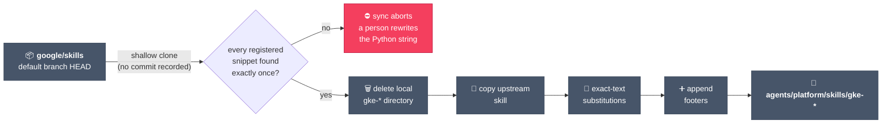
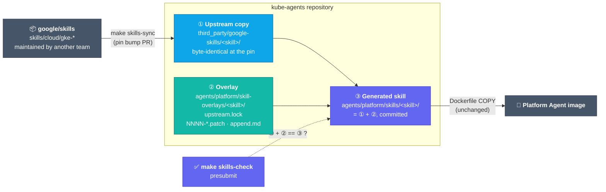
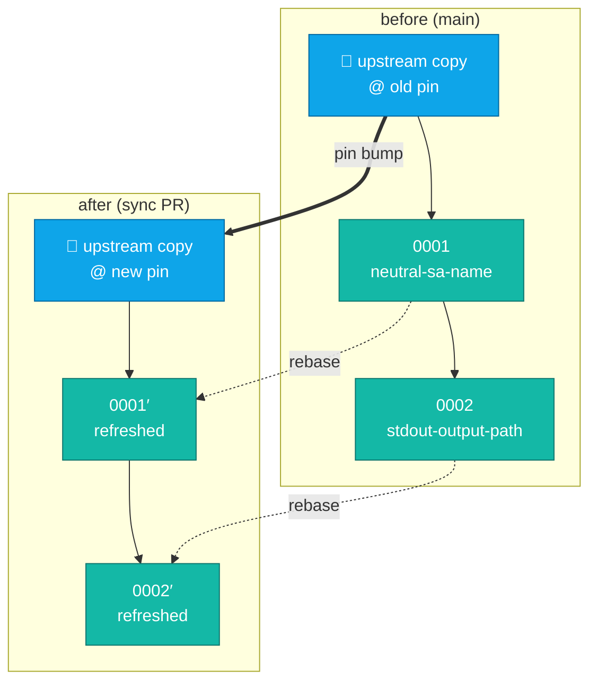
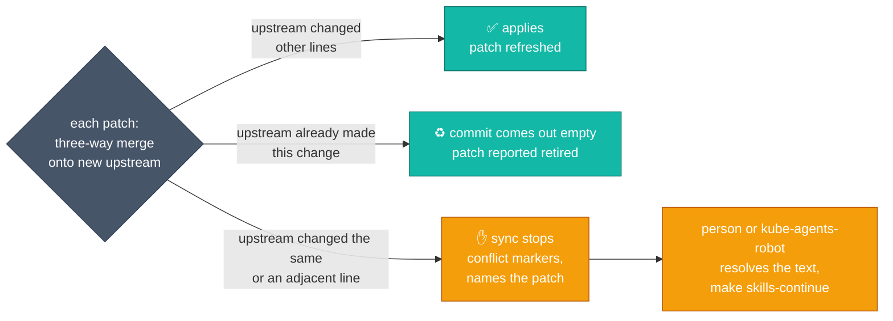
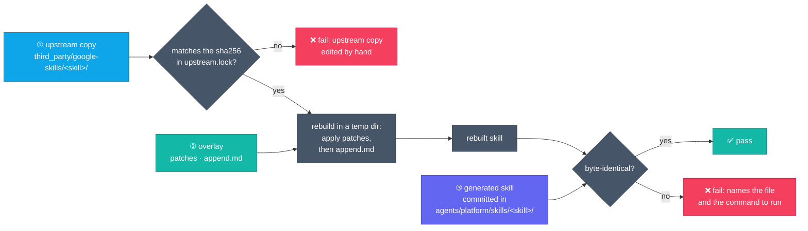
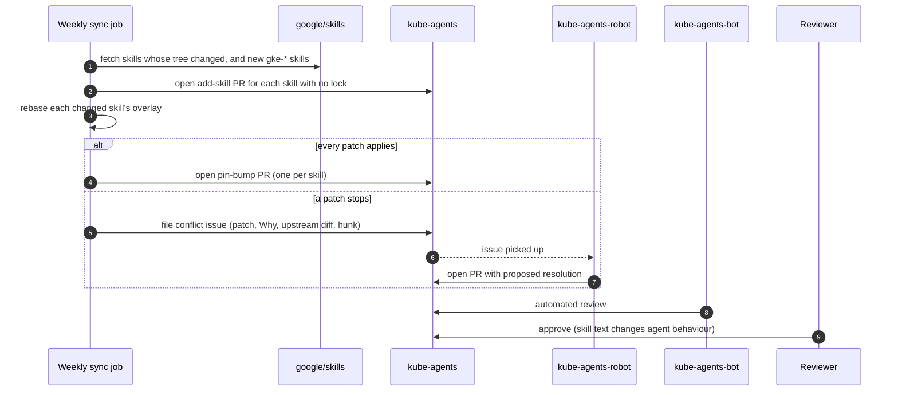

# Upstream skill overlays

> **STATUS — design; not implemented.** `scripts/sync-upstream-skills.py` and its string
> registries are what runs on `main`. The implementation plan is tracked in
> [#2374](https://github.com/gke-labs/kube-agents/issues/2374); the policy questions it answers
> were raised in [#1450](https://github.com/gke-labs/kube-agents/issues/1450).

The `gke-*` skills under `agents/platform/skills/` are copies of `skills/cloud/gke-*` in
[`google/skills`](https://github.com/google/skills), the repository
`scripts/sync-upstream-skills.py` syncs from. Another team maintains it, and it accepts issues but
no external pull requests. This repository has to change some of those skills for its own runtime —
the credential proxy, `$HERMES_HOME`, routing to skills only this repository has, the platform
persona's rules — and keep taking upstream's updates. The changes therefore live here for as long as
the skills do.

This document replaces the way those changes are stored and re-applied. Each mirrored skill becomes
three layers: an exact upstream copy at a pinned commit, an overlay of patch files, and the
generated skill the image ships. A sync rebases the patches onto a new upstream copy so git merges
them, and a presubmit check holds the generated skill to the other two layers.

## What happens today

The sync script shallow-clones upstream's default branch, deletes each local `gke-*` directory,
copies the upstream one over it, then re-applies this repository's changes from Python string
constants: `SKILL_SUBSTITUTIONS` replaces an exact snippet of `SKILL.md`, `SKILL_FOOTERS` appends a
section, and each new kind of edit has needed a new registry.



Five properties of this follow from the picture:

- Because no upstream commit is recorded, there is no common ancestor between what upstream ships
  now and what this repository changed. The script can only compare our replacement against the
  new text, so any edit anywhere inside a matched snippet — including lines inside it that we kept
  unchanged — stops the sync until a person rewrites the string.
- The changes live in one script, far from the files they change, and about 240 of its 754 lines
  are skill text. Every local change to a skill, and most syncs, edit that file, so parallel skill
  updates conflict there.
- The repository tests check that each registered substitution, and one of the five footers, is
  present in the tree. Nothing checks that the tree holds nothing else, so a direct edit to a
  mirrored file passes review and is lost on the next sync.
- A substitution that upstream later adopts is skipped silently and stays in the script; a footer
  whose text upstream adopts is appended a second time, because only the footer's marker is checked.
- Upstream content becomes agent instructions with no pinned ref and no checksum, which
  `test_C4_upstream_skills_are_pinned_and_verified` in `tests/conformance/test_C_enforcement.py`
  records as a known violation of requirement C4.

## The three layers



The **upstream copy** is what upstream shipped at the pinned commit, byte for byte, and nobody edits
it by hand. A sync pull request therefore shows upstream's change on its own, as a diff of this
directory. It sits outside `agents/platform/skills/`, so the image build, the skill catalogue
generator and the skill command check never see it. It takes the `.prettierignore` and
`make shellcheck` exclusions the mirrored skills have today; the docs map has no exclusion for them,
so `docs/README.md` gains inventory rows for the copy's Markdown and for `append.md`. The copies of
the 29 mirrored skills add about 440 KiB of text.

The **overlay** is this repository's change to one skill, and every mirrored skill has one, even if
it holds only the lock. `upstream.lock` records the upstream commit and the sha256 of the upstream
skill tree at that commit; the sync writes it, and the sync and the presubmit check verify the
upstream copy against it. That pin and checksum are what requirement C4 asks for. One lock per
skill, rather than one shared file, keeps the one-skill-per-PR syncs from editing neighbouring lines
of the same file, which git would treat as a conflict.

The lock files are also the list of what is mirrored. A skill counts as mirrored because it has a
lock, not because its name starts with `gke-`, so the sync never touches a skill this repository
writes, whatever its name. When upstream drops or renames a skill, the sync reports it rather than
deleting anything, and a person moves or removes the copy, the overlay and the lock.

Each patch is one change in `git format-patch` form, and its header records the reason in the place
a reader of the skill directory will find it:

```diff
Subject: Open a pull request in Step 5 only when the request asked for the fix

Why: the platform persona proposes a fix in its reply unless asked to
submit it (SOUL.md §3, item 3); upstream opens a PR on every crashloop walk.
Local-Issue: #2037
Upstream-Issue: none (specific to this repository)
Retire-When: never; the persona rule is ours

--- a/SKILL.md
+++ b/SKILL.md
@@ -224,8 +224,12 @@
 ...
-3.  Check if a branch or Pull Request (PR) already exists for this
-    workload/failure. If so, update the existing branch/PR or notify the user
+3.  If the request asked for the fix to be submitted or applied ("fix it",
+    "open a PR", a card whose task says so), check whether a branch or Pull
 ...
```

Patch files are written without commit hashes, `index` lines or a diffstat, so refreshing one
changes only the hunk headers and the lines that moved. A patch can touch any file in the skill —
`SKILL.md`, a reference, an asset, a script — or add one. `append.md` holds what `SKILL_FOOTERS`
appends today. An append is applied after the patches rather than as one, because git treats an
edit to upstream's last lines as adjacent to anything appended below them and would stop on it.

Patches apply in filename order, and every patch file in the overlay is applied; there is no
separate list of them. `make skills-refresh` names a new patch with the next free number and a slug
from its subject, and removing a patch means deleting its file. Two pull requests that change the
same skill at the same time can both pick `0003`; their slugs differ, so the files do not collide,
and the tie sorts by slug.

The alternative is a `series` file listing the patches in order, as `quilt` does. Every new patch is
made on top of the existing ones, so it is added on the last line of that list, and two pull
requests that each add a patch both write that line. Git sees two edits at the same place in one
file and reports a conflict, even when the two patches change unrelated parts of the skill:

| Two concurrent pull requests on one skill            | With a `series` file                                                 | Filename order                             |
| ---------------------------------------------------- | -------------------------------------------------------------------- | ------------------------------------------ |
| Change the same lines of the skill                   | Conflict in the skill; the second author rebases and refreshes       | The same                                   |
| Change unrelated lines of the skill                  | Conflict in `series`; the second author rebases and keeps both lines | Merges on its own                          |
| One or both opened by a bot (sync, add-skill, robot) | Someone rebases the bot's pull request                               | Merges on its own unless the lines overlap |
| Merged by Tide once approved                         | Not while `series` conflicts                                         | Yes                                        |

A `series` conflict is easy to resolve, but it falls on every pair of concurrent pull requests and
on every bot-opened one, and git's `union` merge mode does not help because GitHub ignores it when
deciding whether a pull request conflicts. What filename order gives up is switching a patch off
while keeping its file, which git history covers. If two changes touch neighbouring lines, the check
on the second pull request fails once the first merges, and `make skills-refresh` on its rebased
branch rewrites its patch.

One patch holds one change, for one reason: the `Why:` header describes it, and the sync retires it
as a unit. Follow-up edits to a change are folded into its patch rather than added beside it, so the
count tracks the number of reasons this repository disagrees with upstream, not the number of edits.
On today's registries that is seven patches across four skills, the most in one skill being four,
plus five `append.md` files. A skill that passes about five patches is a signal to send the general
ones upstream as `google/skills` issues, or to stop mirroring it: delete its upstream copy, lock and overlay,
and the generated skill becomes an ordinary skill this repository owns.

The **generated skill** stays where skills are today and stays committed, so it is what reviewers,
`grep`, the bench tasks and the Dockerfile read. Contributors edit it like any other file, and
`make skills-refresh` records the edit as a patch; the presubmit check fails on an edit that no patch
records.

## Sync: rebasing the overlay

A sync bumps one skill's pin. It runs in a scratch repository so the working tree only changes when
the result is ready:

1. Commit the old upstream copy, then each patch on top of it, in filename order, as its own commit.
2. Commit the new upstream copy on a separate branch from the same root.
3. Rebase the patch commits onto the new upstream copy with `git rebase --empty=drop`.
4. Write the new upstream copy and `upstream.lock`, re-export the surviving commits as the patch
   files, and regenerate the skill.



Each patch is merged three ways: the old upstream copy is the common ancestor, the patch is our
side, and the new upstream copy is theirs. That ancestor is what the current script lacks. Each
patch ends one of three ways:



What counts as "other lines" was measured with git 2.56, rebasing two patches that
change lines 10–11 and 25 of a file onto a changed upstream, and one patch onto an
upstream that renamed or deleted the patched file:

| Upstream change                   | Today's script                        | Rebase                         |
| --------------------------------- | ------------------------------------- | ------------------------------ |
| Lines inserted above the patch    | applies (snippet still matches)       | applies                        |
| Edit two or three lines away      | stops if the line is inside a snippet | applies                        |
| Edit on the adjacent line (12)    | stops if the line is inside a snippet | stops with conflict markers    |
| Edit on a patched line (10)       | stops                                 | stops with conflict markers    |
| Same change as patch 2 (line 25)  | skipped silently, entry stays         | patch dropped, reported        |
| Patched file renamed, then edited | stops (file not found)                | applies to the renamed file    |
| Patched file deleted              | stops (file not found)                | stops (modify/delete conflict) |

A stop is the same situation as a merge conflict between two branches: upstream and this
repository both rewrote one passage, and only someone who knows what each meant can write the
merged text. Any automatic rule would pick a side, which either drops our correction or drops
upstream's improvement without anyone noticing. The design keeps that decision with a person and
automates everything around it.

## The presubmit check

`make skills-check` verifies each upstream copy against its lock's checksum, rebuilds each generated
skill from its upstream copy and overlay in a temporary directory, and compares the result with `agents/platform/skills/<skill>/` byte for byte. It reads
only committed files, so it needs no network and cannot fail because GitHub is slow. Patches are
refreshed against the current upstream copy on every sync, so the check applies them without
merging; a patch that needs a merge to apply is itself a failure.



The check and the sync cover each other. The check guarantees that every change to a generated
skill is recorded in its overlay; the sync guarantees that what the overlay records survives an
upstream update. The repository tests that each assert one registered change is present are no
longer needed, because the check covers every byte of every mirrored skill.

## Changing a mirrored skill

To make a new change, edit the generated skill, for example
`agents/platform/skills/gke-basics/SKILL.md`, and run `make skills-refresh SKILL=gke-basics`.
Refresh rebuilds the skill from the upstream copy, the existing patches and `append.md`, compares
the edited skill with that result, and writes the difference as a new patch. Fill in its `Why:`,
`Local-Issue:`, `Upstream-Issue:` and `Retire-When:` headers and commit the patch with the edited
skill. The reviewer reads the change to the skill itself and the patch that records it; the upstream
copy does not change.

To adjust a change that already has a patch, edit the skill the same way and run
`make skills-refresh SKILL=gke-basics PATCH=0002`, which folds the edit into patch `0002` instead of
adding one. An edit inside the appended section is written back to `append.md` whichever form is
used.

To work on the overlay directly — remove a patch, edit one by hand, change `append.md` — make the
change there and run `make skills-generate SKILL=gke-basics`, which rebuilds the generated skill
from the upstream copy and the overlay. It reads only committed files and needs no network.

`make skills-check` in CI catches the step that was skipped. Each failure names the file and the
command that fixes it:

| What happened                                               | What the check sees                               | Fix                          |
| ----------------------------------------------------------- | ------------------------------------------------- | ---------------------------- |
| The skill was edited and no patch records the edit          | the rebuilt skill differs from the committed one  | `make skills-refresh`        |
| A patch or `append.md` was edited and the skill not rebuilt | the rebuilt skill differs from the committed one  | `make skills-generate`       |
| The upstream copy was edited by hand                        | the copy no longer matches the sha256 in its lock | revert it; sync to change it |

A change takes effect when its pull request merges and the image is rebuilt, as any skill change does
today. Upstream updates arrive separately, through the sync.

### Automated edits to a generated skill

A tool that edits files in place cannot run `make skills-refresh`, so its edit to a generated skill
fails the check. One does so today: Dependabot's `docker` entry in `.github/dependabot.yml` bumps the
base image in `agents/platform/skills/gke-app-onboarding/assets/Dockerfile`, which reads
`FROM node:26-slim` while upstream's copy reads `FROM node:22-slim`. No registry entry records the
difference, so the next run of today's script would put upstream's pin back. Under this design the
migration records the pin as a patch on `gke-app-onboarding`, whose `Why:` says why this repository
runs a newer base image than upstream; the Dependabot entry for that directory is removed; and the
base image is bumped by changing the patch. Any other in-place tool pointed at a mirrored skill's
generated directory gets the same treatment.

## Automation

A weekly job runs the sync for each mirrored skill whose upstream tree changed, and opens one pull
request per skill, the way Dependabot opens one per dependency. It also lists the upstream
`skills/cloud/gke-*` directories that have no lock here and opens a pull request for each that adds
the upstream copy, a lock, an empty overlay and the generated skill (identical to the upstream copy
until a patch is added), so a skill upstream adds ships and is adopted the way
the current script adopts it. It opens them as
`kube-agents-robot` or with a GitHub App token, because a pull request opened with the workflow's
`GITHUB_TOKEN` does not start other workflows. When every patch applies, the pull request is ready
for review. When one stops, the job files an issue carrying the patch and its `Why:` header, the
upstream diff and the conflicting hunk, which `kube-agents-robot` picks up like any other issue.



The resolution still goes through a person because a skill is instructions the agent follows: a
merge that reads well can still change what the agent does. Upstreaming shrinks the work from the
other end. A patch that fixes something every user of upstream hits — the NetworkPolicy two-step,
the `answer_query` quota — is filed as a `google/skills` issue and recorded in `Upstream-Issue:`; once
upstream carries it, the next sync reports it retired.

## Alternatives considered

| Approach                                         | Why not                                                                                                                                                                                                                                                                                         |
| ------------------------------------------------ | ----------------------------------------------------------------------------------------------------------------------------------------------------------------------------------------------------------------------------------------------------------------------------------------------- |
| Keep the string registries                       | No common ancestor, so any edit inside a snippet stops the sync; changes stay in one shared file away from the skills; new machinery per kind of edit.                                                                                                                                          |
| Vendor branch or `git subtree` merges into main  | Real merges, but main is squash-merged, which loses the merge base a subtree merge needs; nothing records why each local change exists; "what do we change" needs a diff against upstream.                                                                                                      |
| Heading-keyed overlays (Kustomize-like)          | Kustomize can address fields because Kubernetes objects have a schema. Markdown does not: list items, fenced blocks and frontmatter scalars, which several current changes edit, are not addressable by heading, so the engine falls back to text matching.                                     |
| Whole-file override with an upstream-hash alarm  | Simple, but it forks the whole file, and every upstream change to it is a manual re-merge.                                                                                                                                                                                                      |
| Runtime composition (companion skill or persona) | Leaves upstream untouched, but the model then holds two instructions that disagree, and the existing registry already uses substitutions instead of footers for exactly those cases. A companion also cannot change the frontmatter `description` the router selects on.                        |
| `git apply --3way` per patch                     | Merges only when the patch records the blob it was made against. For every patch after the first that blob is an intermediate state, so the earlier patches have to be replayed on the old copy to rebuild it, which is a rebase without dropping adopted patches or resuming after a conflict. |
| Copybara with `patch.apply`                      | Google's standard tool for this, but it brings a Java toolchain and Starlark config into CI for about 30 directories. The layout here can move to it later.                                                                                                                                     |

## Costs

The repository holds two copies of each mirrored skill. The tooling is a new script with five
subcommands (`sync`, `continue`, `refresh`, `generate`, `check`) and its tests. Patch files are awkward to edit by hand, which is why the workflow goes
through `make skills-refresh`, and a sync pull request carries refreshed patch files alongside the
upstream diff and the generated diff. Migration rewrites the script that open skill-sync pull
requests edit, so it lands after them.

## Rollout

1. Tooling, the upstream copy with its docs-map rows and exclusions, and one pilot skill with a
   single substitution.
2. The presubmit check.
3. Every other skill migrated with the generated tree byte-identical to `main`; registries, their
   tests and the old script removed. Every file that names the old script or its registries
   follows: the Skills Guidelines rule in `AGENTS.md`, the `skill_sync` source in
   `tests/conformance/_harness.py` and the C4 tests that read it, repointed at the new script, the
   `make shellcheck` comment in `Makefile`, `.prettierignore`, the message in
   `deploy/docker/check_skill_commands.py`, and comments in two bench tasks and
   `agents/platform/scripts/gke_endpoint.py`. The Dependabot `docker` entry for
   `agents/platform/skills/gke-app-onboarding/assets` in `.github/dependabot.yml` is removed (see
   [Automated edits to a generated skill](#automated-edits-to-a-generated-skill)).
4. The weekly sync job, including add-skill pull requests.
5. Conflict issues routed to `kube-agents-robot`.
