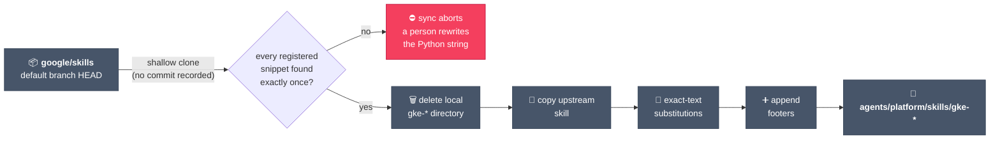
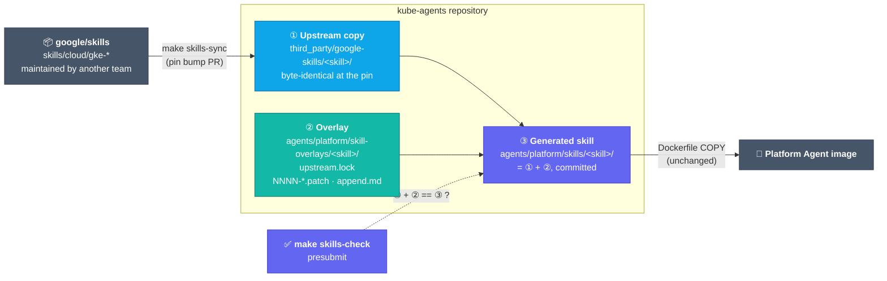
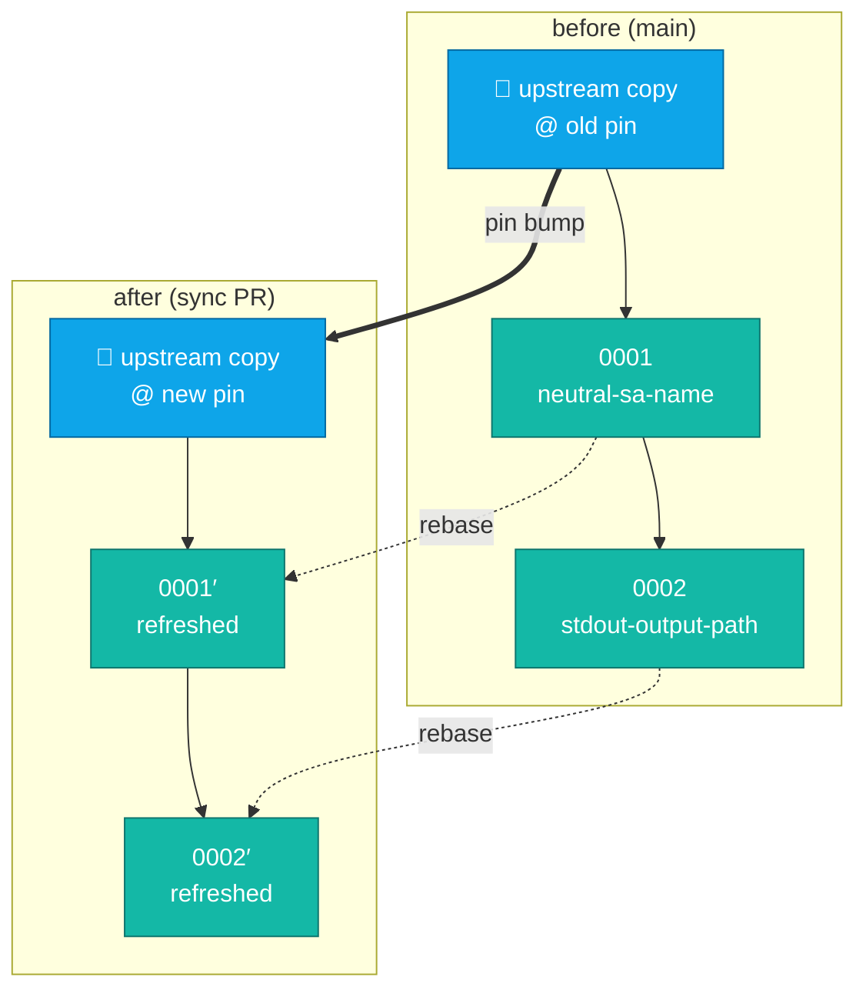
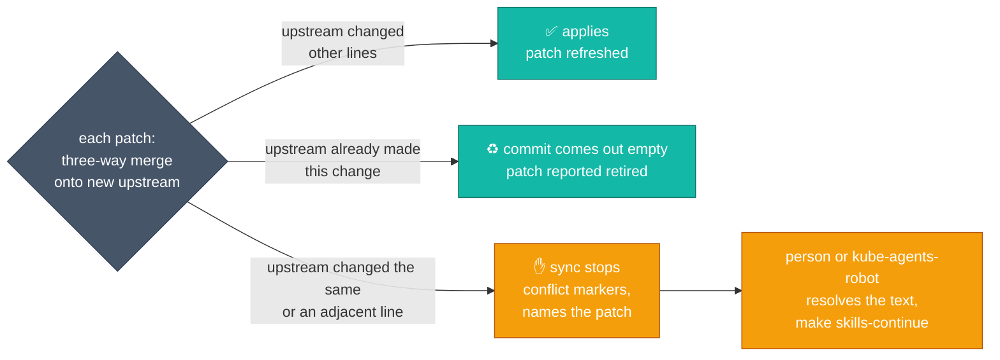
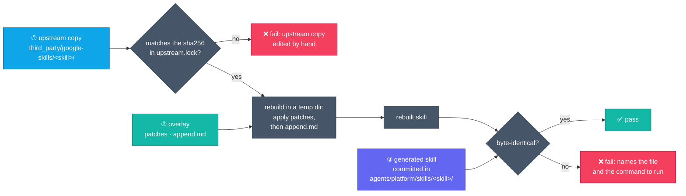
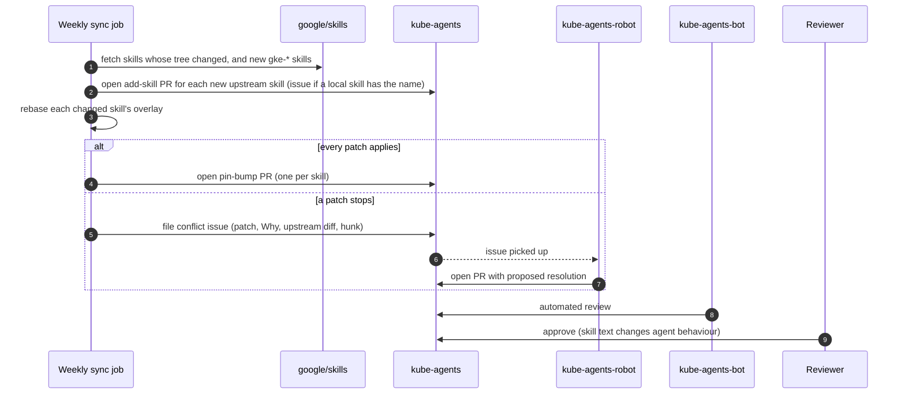

# Upstream skill overlays

> **STATUS — design; not implemented.** `scripts/sync-upstream-skills.py` and its string
> registries are what runs on `main`. The implementation plan is tracked in
> [#2374](https://github.com/gke-labs/kube-agents/issues/2374); the policy questions it answers
> were raised in [#1450](https://github.com/gke-labs/kube-agents/issues/1450).

## Summary

| Question   | Answer                                                                                                                                                                                                                    |
| ---------- | ------------------------------------------------------------------------------------------------------------------------------------------------------------------------------------------------------------------------- |
| What       | The 29 `gke-*` skills under `agents/platform/skills/` are copies of `skills/cloud/gke-*` in [`google/skills`](https://github.com/google/skills), the repository `scripts/sync-upstream-skills.py` syncs from.             |
| Constraint | Another team maintains `google/skills`; it accepts issues but no external pull requests. Our changes (credential proxy, `$HERMES_HOME`, routing to our own skills, persona rules) live here for as long as the skills do. |
| Problem    | Today those changes are exact-text Python strings re-applied after a wholesale overwrite. That breaks on upstream rewording, conflicts across parallel PRs, and loses unregistered edits silently.                        |
| Proposal   | Three layers per skill: a pinned upstream copy, an overlay of patch files, and the generated skill the image ships. A sync rebases the patches so git merges them; a presubmit holds the three layers together.           |
| Cost       | A second copy of each mirrored skill (about 440 KiB), a five-subcommand tool, and one-time migration after the open skill-sync PRs land.                                                                                  |

## What happens today

The sync script shallow-clones upstream's default branch, deletes each local `gke-*` directory,
copies the upstream one over it, then re-applies our changes from Python string constants.



| #   | Fault                             | Effect                                                                                                                                                                                                 |
| --- | --------------------------------- | ------------------------------------------------------------------------------------------------------------------------------------------------------------------------------------------------------ |
| F1  | No upstream commit recorded       | No common ancestor, so any upstream edit inside a matched snippet — even to lines we kept — stops the sync until a person rewrites the Python string.                                                  |
| F2  | Changes live in the script        | About 240 of the script's 754 lines are skill text, away from the skills they change. Each new kind of edit has needed a new registry (`SKILL_SUBSTITUTIONS`, `SKILL_FOOTERS`, then a file-level one). |
| F3  | One shared file                   | Every local change and most syncs edit the script, so parallel skill PRs conflict there.                                                                                                               |
| F4  | Unregistered edits are not caught | Tests check each registered substitution and one of the five footers. A direct edit to a mirrored file passes review and is lost on the next sync.                                                     |
| F5  | Upstream adoption is mishandled   | An adopted substitution is skipped silently and stays in the script forever; an adopted footer is appended a second time (only its marker is checked).                                                 |
| F6  | No pin, no checksum               | Upstream content becomes agent instructions unverified; `test_C4_upstream_skills_are_pinned_and_verified` in `tests/conformance/test_C_enforcement.py` records this as a known violation of C4.        |
| F7  | Prune by name                     | Any local `gke-*` directory upstream lacks is deleted on the next sync, so a skill we write with that prefix is lost.                                                                                  |
| F8  | Manual, all-at-once sync          | One run refreshes every skill from `HEAD`; nothing schedules it, and nothing proposes new upstream skills until someone runs it.                                                                       |

## Proposed design



How each fault is addressed:

| #   | Fix                                                                                                                   | Section                                                         |
| --- | --------------------------------------------------------------------------------------------------------------------- | --------------------------------------------------------------- |
| F1  | The lock pins each skill's upstream commit; the sync rebases our patches onto the new copy, so git merges three ways. | [Sync](#sync-rebasing-the-overlay)                              |
| F2  | Each change is a patch file next to the skill it changes; one mechanism covers every file type.                       | [The three layers](#the-three-layers)                           |
| F3  | One overlay directory and one lock per skill, patches ordered by filename: no shared file to conflict on.             | [Patch order](#patch-order-no-series-file)                      |
| F4  | `make skills-check` rebuilds every mirrored skill and fails on any byte no patch records.                             | [The presubmit check](#the-presubmit-check)                     |
| F5  | A patch upstream adopts comes out of the rebase empty and is reported retired.                                        | [Sync](#sync-rebasing-the-overlay)                              |
| F6  | `upstream.lock` holds the commit and a sha256; the check and the upstream comparison verify them.                     | [Security guardrails](#security-guardrails)                     |
| F7  | A skill is mirrored because it has a lock, not because of its name; local skills are never touched.                   | [Skills this repository writes](#skills-this-repository-writes) |
| F8  | A weekly job opens one pin-bump PR per changed skill and an add-skill PR per new upstream skill.                      | [Automation](#automation)                                       |

### The three layers

| Layer             | Path                                      | Contents                                                         | Changed by                                          |
| ----------------- | ----------------------------------------- | ---------------------------------------------------------------- | --------------------------------------------------- |
| ① Upstream copy   | `third_party/google-skills/<skill>/`      | `skills/cloud/<skill>/` byte-identical at the pinned commit      | The sync only                                       |
| ② Overlay         | `agents/platform/skill-overlays/<skill>/` | `upstream.lock`, `NNNN-<slug>.patch` files, optional `append.md` | Contributors, via `make skills-refresh` or directly |
| ③ Generated skill | `agents/platform/skills/<skill>/`         | ① with ② applied; committed                                      | `make skills-refresh` / `make skills-generate`      |

- **Upstream copy.** Outside `agents/platform/skills/`, so the image build, catalogue generator and skill command check never see it. Takes the `.prettierignore` and `make shellcheck` exclusions the mirrored skills have today; `docs/README.md` gains inventory rows for it and for `append.md` (the docs map has no exclusion for skill files). A sync PR shows upstream's change on its own, as a diff of this directory.
- **`upstream.lock`.** Upstream commit plus the sha256 of the upstream skill tree. The sync rewrites it in the same PR that replaces the copy, so the two match unless the copy was edited by hand. One lock per skill keeps per-skill PRs from editing neighbouring lines of a shared file.
- **The lock files are the mirrored list.** Every mirrored skill has an overlay directory, even if it holds only the lock. When upstream drops or renames a skill, the sync reports it and a person moves or removes the copy, overlay and lock; nothing is deleted automatically.
- **Patches.** One change per file in `git format-patch` form, written without commit hashes, `index` lines or a diffstat so a refresh changes only hunk headers and moved lines. A patch can touch any file in the skill or add one. Its header records why:

```diff
Subject: Open a pull request in Step 5 only when the request asked for the fix

Why: the platform persona proposes a fix in its reply unless asked to
submit it (SOUL.md §3, item 3); upstream opens a PR on every crashloop walk.
Local-Issue: #2037
Upstream-Issue: none (specific to this repository)
Retire-When: never; the persona rule is ours

--- a/SKILL.md
+++ b/SKILL.md
@@ -224,8 +224,12 @@
 ...
-3.  Check if a branch or Pull Request (PR) already exists for this
-    workload/failure. If so, update the existing branch/PR or notify the user
+3.  If the request asked for the fix to be submitted or applied ("fix it",
+    "open a PR", a card whose task says so), check whether a branch or Pull
 ...
```

- **One patch per reason.** Follow-up edits fold into the existing patch, so the count tracks reasons, not edits: today's registries become seven patches across four skills (at most four in one skill) plus five `append.md` files.
- **Patch-count threshold.** A skill past about five patches is a signal to file the general ones as `google/skills` issues, or to stop mirroring it (delete its copy, lock and overlay; the generated skill becomes ours).
- **`append.md`.** Holds what `SKILL_FOOTERS` appends today. Applied after the patches rather than as one, because git treats an edit to upstream's last lines as adjacent to anything appended below them.
- **Generated skill.** Stays where skills are today and stays committed, so reviewers, `grep`, the bench tasks and the Dockerfile read it. Contributors edit it like any other file; the presubmit fails on an edit no patch records.

### Patch order: no series file

- Patches apply in filename order; every patch file in the overlay is applied.
- `make skills-refresh` names a new patch with the next free number and a slug from its subject; removing a patch means deleting its file.
- Two concurrent PRs can both pick `0003`; the slugs differ, so the files do not collide and the tie sorts by slug.

The alternative is a `series` file listing patches in order, as `quilt` does. Every new patch goes on its last line, so two PRs that each add a patch both write that line:

| Two concurrent pull requests on one skill            | With a `series` file                                                 | Filename order                             |
| ---------------------------------------------------- | -------------------------------------------------------------------- | ------------------------------------------ |
| Change the same lines of the skill                   | Conflict in the skill; the second author rebases and refreshes       | The same                                   |
| Change unrelated lines of the skill                  | Conflict in `series`; the second author rebases and keeps both lines | Merges on its own                          |
| One or both opened by a bot (sync, add-skill, robot) | Someone rebases the bot's pull request                               | Merges on its own unless the lines overlap |
| Merged by Tide once approved                         | Not while `series` conflicts                                         | Yes                                        |

- A `series` conflict is easy to resolve, but it falls on every concurrent pair and every bot PR.
- Git's `union` merge mode does not help: GitHub ignores it when deciding whether a PR conflicts.
- Filename order gives up switching a patch off while keeping its file; git history covers that.
- If two changes touch neighbouring lines, the check on the second PR fails once the first merges, and `make skills-refresh` on its rebased branch rewrites its patch.

### Sync: rebasing the overlay

A sync bumps one skill's pin, in a scratch repository, so the working tree changes only when the result is ready:

1. Commit the old upstream copy, then each patch on top of it, in filename order, as its own commit.
2. Commit the new upstream copy on a separate branch from the same root.
3. Rebase the patch commits onto the new upstream copy with `git rebase --empty=drop`.
4. Write the new upstream copy and `upstream.lock`, re-export the surviving commits as the patch files, and regenerate the skill.



Each patch is merged three ways — old upstream copy as common ancestor, patch as ours, new copy as theirs — and ends one of three ways:



Measured with git 2.56: two patches changing lines 10–11 and 25 of a file rebased onto a changed upstream, and one patch onto an upstream that renamed or deleted the patched file.

| Upstream change                   | Today's script                        | Rebase                         |
| --------------------------------- | ------------------------------------- | ------------------------------ |
| Lines inserted above the patch    | applies (snippet still matches)       | applies                        |
| Edit two or three lines away      | stops if the line is inside a snippet | applies                        |
| Edit on the adjacent line (12)    | stops if the line is inside a snippet | stops with conflict markers    |
| Edit on a patched line (10)       | stops                                 | stops with conflict markers    |
| Same change as patch 2 (line 25)  | skipped silently, entry stays         | patch dropped, reported        |
| Patched file renamed, then edited | stops (file not found)                | applies to the renamed file    |
| Patched file deleted              | stops (file not found)                | stops (modify/delete conflict) |

- A stop is a real merge conflict: upstream and we rewrote the same passage, and only someone who knows both intents can write the merged text.
- Any automatic rule would pick a side and silently drop either our correction or upstream's improvement, so the decision stays with a person and everything around it is automated.

### The presubmit check

- `make skills-check` verifies each upstream copy against its lock's checksum, rebuilds each generated skill from ① and ② in a temp directory, and compares the result with ③ byte for byte.
- Reads only committed files: no network, so it cannot fail because GitHub is slow.
- Patches are refreshed on every sync, so the check applies them without merging; a patch that needs a merge to apply is itself a failure.



- The check guarantees every change to a generated skill is recorded in its overlay; the sync guarantees what the overlay records survives an upstream update.
- The `test_repo_*` tests that each assert one registered change are no longer needed: the check covers every byte of every mirrored skill.

### Changing a mirrored skill

| Task                                | Steps                                                                                                                                      |
| ----------------------------------- | ------------------------------------------------------------------------------------------------------------------------------------------ |
| Make a new change                   | Edit `agents/platform/skills/<skill>/…`; run `make skills-refresh SKILL=<skill>`; fill in the new patch's headers; commit patch and skill. |
| Adjust an existing change           | Edit the skill; run `make skills-refresh SKILL=<skill> PATCH=<nnnn>` to fold the edit into that patch.                                     |
| Edit the appended section           | Edit it in the skill; `refresh` writes it back to `append.md`.                                                                             |
| Remove a change or edit the overlay | Delete or edit the patch (or `append.md`); run `make skills-generate SKILL=<skill>`. Offline, about a second.                              |

- The reviewer sees the change to the skill and the patch that records it; the upstream copy does not change.
- A change takes effect when its PR merges and the image is rebuilt, as today. Upstream updates arrive separately, through the sync.

What `make skills-check` reports when a step is skipped:

| What happened                                               | What the check sees                               | Fix                          |
| ----------------------------------------------------------- | ------------------------------------------------- | ---------------------------- |
| The skill was edited and no patch records the edit          | the rebuilt skill differs from the committed one  | `make skills-refresh`        |
| A patch or `append.md` was edited and the skill not rebuilt | the rebuilt skill differs from the committed one  | `make skills-generate`       |
| The upstream copy was edited by hand                        | the copy no longer matches the sha256 in its lock | revert it; sync to change it |

### Skills this repository writes

- Added as today: a directory under `agents/platform/skills/`, with no upstream copy, overlay or lock.
- The sync and the check skip it, whatever its name — including `gke-*`, which today's script would delete (F7).

### Automated edits to a generated skill

- A tool that edits files in place cannot run `make skills-refresh`, so its edit fails the check.
- One does so today: Dependabot's `docker` entry in `.github/dependabot.yml` bumps `agents/platform/skills/gke-app-onboarding/assets/Dockerfile`, now `FROM node:26-slim` against upstream's `FROM node:22-slim`, with no registry entry — the next run of today's script would put upstream's pin back.
- Migration records that pin as a patch (its `Why:` says why we run a newer base image), removes the Dependabot entry for that directory, and bumps the image by changing the patch. Any other in-place tool pointed at a mirrored skill gets the same treatment.

### Automation

- A weekly job syncs each mirrored skill whose upstream tree changed and opens one PR per skill, the way Dependabot opens one per dependency.
- It opens an add-skill PR for each upstream `skills/cloud/gke-*` directory with no lock: upstream copy, lock, empty overlay and the generated skill (identical to the copy until a patch is added), so the skill ships.
- If a lock-less local skill already has that name, it files an issue instead; a person renames ours, adopts upstream's with our differences as patches, or leaves upstream's unmirrored. The job never writes over a skill it does not own.
- PRs are opened as `kube-agents-robot` or with a GitHub App token: a PR opened with the workflow's `GITHUB_TOKEN` does not start other workflows.
- When a patch stops, the job files an issue with the patch and its `Why:`, the upstream diff and the conflicting hunk; `kube-agents-robot` picks it up like any other issue.



- The resolution still needs a person: a skill is instructions the agent follows, and a merge that reads well can still change what the agent does.
- Upstreaming shrinks the work: a general fix (the NetworkPolicy two-step, the `answer_query` quota) is filed as a `google/skills` issue and recorded in `Upstream-Issue:`; once upstream carries it, the next sync reports it retired.

## Security guardrails

GitHub has no read-only directories, so every guardrail below is something this design adds. None exists today. Each blocks merge because it runs inside a required check or through Tide's approval gate.

| Scenario                                                                 | Risk                                                                                                                       | Guardrail                                                                                                                                         |
| ------------------------------------------------------------------------ | -------------------------------------------------------------------------------------------------------------------------- | ------------------------------------------------------------------------------------------------------------------------------------------------- |
| Two concurrent, unrelated changes to one skill                           | A shared list makes every pair conflict, so bot PRs stall and authors resolve by hand                                      | No shared file: filename-ordered patches and a lock per skill. The check reruns on the merged result, so an overlap still fails and is refreshed. |
| Direct edit to a generated skill with no patch                           | The edit is lost on the next sync                                                                                          | `make skills-check` rebuilds ① + ② and fails on any difference from ③.                                                                            |
| Accidental edit to the upstream copy                                     | Edit the copy, run `make skills-generate`, and the comparison passes with no patch recorded                                | Checksum of ① against `upstream.lock`, offline, every PR.                                                                                         |
| Edit to the upstream copy plus a matching edit to the lock               | The checksum passes; unpublished content becomes agent instructions                                                        | Comparison with `google/skills` at the locked commit, on PRs that change ① or any `upstream.lock`.                                                |
| Lock pinned to a commit that exists only in a fork                       | GitHub serves fork-only commits through the parent repository's URL, so a fetch by commit accepts content nobody published | The same comparison requires the commit to be reachable from upstream's default branch.                                                           |
| Change to the upstream copy approved by someone outside the skill owners | A routine-looking sync PR carries unreviewed instructions                                                                  | `OWNERS` on `third_party/google-skills/` with `no_parent_owners` (as `hack/OWNERS` does), so a root approver does not count.                      |
| Unpinned upstream content (C4)                                           | Whatever is at upstream `HEAD` becomes agent instructions                                                                  | Pin and sha256 in every lock; every pin bump is a reviewed PR.                                                                                    |
| Bot-proposed conflict resolution                                         | A plausible merge changes agent behaviour                                                                                  | `kube-agents-bot` reviews it and a person approves; the robot never merges.                                                                       |
| In-place tool edits a generated skill (Dependabot)                       | A standing red PR, or an edit nobody records                                                                               | The entry is removed and its pin becomes a patch; the check fails any other such tool.                                                            |
| Upstream adds a skill with a local skill's name                          | The add-skill PR overwrites our skill                                                                                      | The job files an issue instead; it never writes over a lock-less skill.                                                                           |

Where the checks run:

| Check                                            | Runs as                                                         | Runs on                                                                                         | Blocks merge because                                                                                             |
| ------------------------------------------------ | --------------------------------------------------------------- | ----------------------------------------------------------------------------------------------- | ---------------------------------------------------------------------------------------------------------------- |
| `make skills-check` (checksum, rebuild, compare) | A step in the `validate` job (`.github/workflows/validate.yml`) | Every PR, offline                                                                               | `validate` is one of the contexts `main` already requires                                                        |
| Comparison with `google/skills`                  | A step in the same job                                          | Every PR; skips itself unless the PR changes `third_party/google-skills/` or an `upstream.lock` | Same job. Not a workflow path filter: a required check that never starts waits as "Expected" and blocks every PR |
| `OWNERS` on the upstream copy                    | Prow's approval plugin; no CI job                               | Every PR that changes the copy                                                                  | Tide merges only with the `approved` label                                                                       |

A new, separately named job would also work, but `main`'s required contexts would need an admin to add it; until then it could fail and the PR still merge.

## Alternatives considered

| Approach                                         | Why not                                                                                                                                                                                                                  |
| ------------------------------------------------ | ------------------------------------------------------------------------------------------------------------------------------------------------------------------------------------------------------------------------ |
| Keep the string registries                       | F1–F7 stay.                                                                                                                                                                                                              |
| Vendor branch or `git subtree` merges into main  | Main is squash-merged, which loses the merge base a subtree merge needs; nothing records why each change exists.                                                                                                         |
| Heading-keyed overlays (Kustomize-like)          | Markdown has no schema: list items, fenced blocks and frontmatter scalars, which current changes edit, are not addressable by heading, so it falls back to text matching.                                                |
| Whole-file override with an upstream-hash alarm  | Forks the whole file; every upstream change to it is a manual re-merge.                                                                                                                                                  |
| Runtime composition (companion skill or persona) | The model holds two instructions that disagree; the registry already prefers substitutions over footers for those cases; a companion cannot change the frontmatter `description` the router selects on.                  |
| `git apply --3way` per patch                     | Merges only when the patch records the blob it was made against; for later patches that blob has to be rebuilt by replaying the series, which is a rebase without dropping adopted patches or resuming after a conflict. |
| Copybara with `patch.apply`                      | Brings a Java toolchain and Starlark config into CI for about 30 directories. The layout here can move to it later.                                                                                                      |

## Costs

- Two copies of each mirrored skill (about 440 KiB for 29 skills).
- A new script with five subcommands (`sync`, `continue`, `refresh`, `generate`, `check`) and its tests.
- Patch files are awkward to edit by hand, hence `make skills-refresh`; a sync PR carries refreshed patches alongside the upstream and generated diffs.
- Migration rewrites the script the open skill-sync PRs edit, so it lands after them.

## Rollout

| Step | Delivers                                                                                                                                                                                                                                                                                                                                                                                                                                                                                                                                                                                                                       |
| ---- | ------------------------------------------------------------------------------------------------------------------------------------------------------------------------------------------------------------------------------------------------------------------------------------------------------------------------------------------------------------------------------------------------------------------------------------------------------------------------------------------------------------------------------------------------------------------------------------------------------------------------------ |
| 1    | Tooling; the upstream copy with its docs-map rows, exclusions and `OWNERS`; one pilot skill with a single substitution.                                                                                                                                                                                                                                                                                                                                                                                                                                                                                                        |
| 2    | `make skills-check` and the comparison with `google/skills`, as steps in `validate`.                                                                                                                                                                                                                                                                                                                                                                                                                                                                                                                                           |
| 3    | Every other skill migrated, generated tree byte-identical to `main`; registries, their tests and the old script removed. Files that name the old script follow: `AGENTS.md` Skills Guidelines, the `skill_sync` source in `tests/conformance/_harness.py` and its C4 tests (repointed at the new script), the `Makefile` shellcheck comment, `.prettierignore`, the message in `deploy/docker/check_skill_commands.py`, comments in two bench tasks and `agents/platform/scripts/gke_endpoint.py`. The Dependabot entry for `gke-app-onboarding/assets` is removed ([Automated edits](#automated-edits-to-a-generated-skill)). |
| 4    | The weekly sync job, add-skill PRs and the name-collision issue.                                                                                                                                                                                                                                                                                                                                                                                                                                                                                                                                                               |
| 5    | Conflict issues routed to `kube-agents-robot`.                                                                                                                                                                                                                                                                                                                                                                                                                                                                                                                                                                                 |
